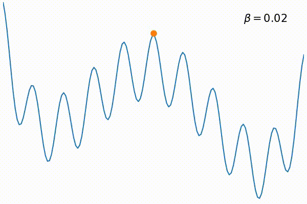
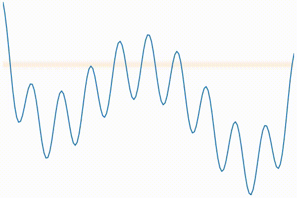

# Visualize Simulated Annealing and Quantum Annealing

This program generates movie which visualize the behavior of simulated annealing (SA) and quantum annealing (QA).

<figure>

<figcaption>Visualization of SA</figcaption>

<figcaption>Visualization of QA</figcaption>
</figure>


## Prerequisite

### Install docker and docker-compose

- [docker-engine][docker-engine] (>= 1.12)
- [docker-compose][docker-compose] (>= 1.9)

### Create `jupyter.env`

Create a file `jupyter.env` in the top directory of this project,
and define your password to login to notebook server in the file.
Each line of the env file is expected to be in `VAR=VAL` format.
Necessary variable in the env file is `NOTEBOOK_PASSWORD`.

``` ini
NOTEBOOK_PASSWORD=your_notebook_password
```

## How to use

1. Start jupyter notebook server

  ``` shell
  $ docker-compose up -d
  ```

  It takes time for the first time because of downloading and install of required packages.

2. Check port number of the server

  Issue the following command to check the port where the notebook server is running.

  ``` shell
  $ docker-compose ps
            Name                          Command               State            Ports
  ----------------------------------------------------------------------------------------------
  saqavisualization_jupyter_1   /usr/bin/tini -- /opt/cond ...   Up      0.0.0.0:32768->8888/tcp
  ```

  In this case, the port is `32768`.


3. Access to the port through browser (google chrome is recommended).

  Open a web browser to the URL of the notebook server (in the above case, http://localhost:32768).

4. Run notebooks

  Resulting movies will be created in the `notebook` directory.


[docker-engine]: https://docs.docker.com/engine/installation/
[docker-compose]: https://docs.docker.com/compose/install/
